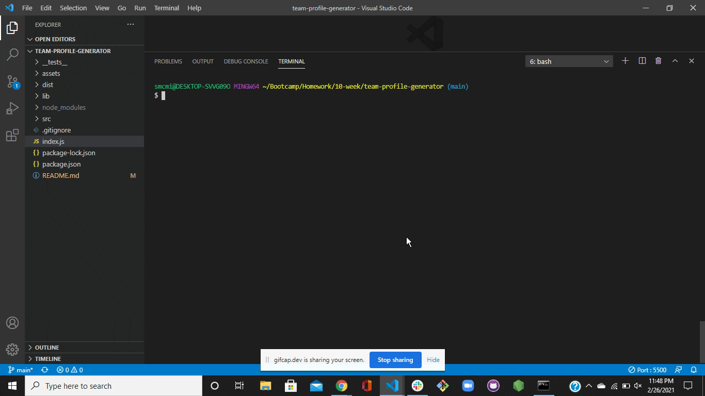

# Team Profile Generator

## Description of Project
In almost every industry, having the ability to quickly generate a clean, easy-to-read team profile page to share with clients is imperative.  This application gives you that capability.  If an old team member leaves or a newbie joins, just run the application again and you'll be able to update it!

Once initiated, you will be led through a series of prompts to fill in employee data based on role.  After you have completed the prompts, your page will automatically generate!

## Table of Contents

- [Usage](#usage)
- [Credits and Code Used](#credits-and-code-used)
- [Application Demo](#application-demo)
- [Questions](#questions)
- [Takeaways](#takeaways)

## Usage
To run the program, type the following command in your terminal:

```bash
node index.js
```

## Credits and Code Used

- Javascript/ES6
- HTML/CSS
- Node.js / Node FS libraray
- npm inquirer and jest packages

## Application Demo



## Questions
Check out my GitHub profile [here.](https://github.com/smcmillan28)

Feel free to send me an email, as well: smcmillan1991@gmail.com

## Takeaways
We keep expanding on our back-end programming capabilities as we head into units dedicated to writing server-based code.  The three primary takeaways from this project are:

- Improving upon command-line applications with Node.js
- Creating classes/subclasses with ES6 and using modularity to separate functionality
- Developing a series of unit tests that correlate with said classes